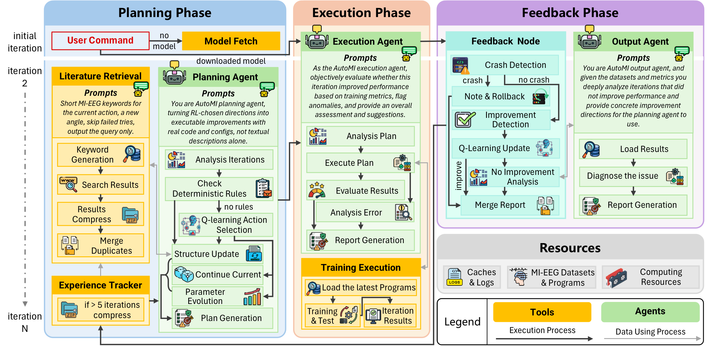

# AutoMI

**基于 LLM 多智能体的免人工干预运动想象脑电分类模型自动优化系统**

<p align="center">
  <a href="README.md">English</a> | <a href="https://doi.org/10.1016/j.jneumeth.2026.110871">Journal of Neuroscience Methods</a>
</p>

<p align="center">
  
  
  
  
  
</p>



AutoMI 是一个全自动的多智能体系统，用于运动想象（MI）脑电分类模型的迭代优化。它将 Q-learning 策略与确定性规则紧密耦合（混合决策机制），协同进化超参数与模型结构，并通过配备确定性回滚与上下文压缩的规则驱动反馈流水线，实现不间断的长时程迭代优化。

## 主要特性

- **闭环多智能体优化** — 规划、执行、输出三个智能体由 LangGraph 工作流与规则驱动反馈节点协同编排。
- **混合决策机制** — Q-learning 与确定性规则耦合，在 `continue_current`、`parameter_evolution`、`structure_update` 三种动作间进行选择，规避 LLM 的盲目试错。
- **参数-结构协同进化** — 直接合成配置覆盖与可执行的结构修改代码，超越预定义搜索空间，并由文献检索注入结构洞见。
- **稳健的长时程迭代** — 执行失败时确定性回滚，经验追踪配合上下文压缩，具备异常捕获与代码自主修复能力。

## 实验结果

论文报告的三个 MI-EEG 数据集（共 73 名受试者）分类准确率（%）：

| 模型 | IV2a | OpenBMI | ECUST-MI |
|---|---|---|---|
| ShallowNet | 58.76 | 63.59 | 63.58 |
| EEGNet | 52.93 | 68.43 | 65.50 |
| IFNet | 69.98 | 71.94 | 69.31 |
| FBMSNet | 68.83 | 69.43 | 59.74 |
| EEGConformer | 54.44 | 70.26 | 70.03 |
| ADFCNN | 66.59 | 74.33 | 70.17 |
| CTNet | 53.16 | 54.73 | 61.82 |
| FBNAS | 59.20 | 68.81 | 63.77 |
| **AutoMI** | **77.62** | **78.08** | **83.02** |

在完全无人工干预的条件下，AutoMI 相对初始基线取得不低于 5.71%（IV2a）、2.92%（OpenBMI）、3.20%（ECUST-MI）的平均准确率提升，单模型最大提升分别达 24.69%、23.35%、23.28%。

## 论文

论文全文见 [`paper/AutoMI.pdf`](paper/AutoMI.pdf)。

Ruiyu Zhao, Shurui Li, Xinjie He, Xingyu Wang, Andrzej Cichocki, Yunhe Lu, Jing Jin. *Hands-Free Motor Imagery EEG Classification via LLM Multi-Agents*.

如在研究中使用 AutoMI，请引用：

```bibtex
@article{automi2026zhao,
  title   = {Hands-free motor imagery EEG classification via LLM multi-agents},
  journal = {Journal of Neuroscience Methods},
  pages   = {110871},
  year    = {2026},
  issn    = {0165-0270},
  doi     = {https://doi.org/10.1016/j.jneumeth.2026.110871},
  author  = {Ruiyu Zhao and Shurui Li and Xinjie He and Xingyu Wang and Andrzej Cichocki and Yunhe Lu and Jing Jin},
}
```

## 安装

### 环境要求

- **Python 3.10 及以上**（最低支持版本）。
- 推荐使用 CUDA GPU 进行训练。
- 一个大模型 API 密钥（Qwen / Claude），见[大模型凭证](#大模型凭证)。

### 配置步骤

1. **创建并激活虚拟环境**（Python >= 3.10）：

   ```bash
   python -m venv .venv
   source .venv/bin/activate        # Windows: .venv\Scripts\activate
   ```

2. **安装 PyTorch**（与本机 CUDA 版本匹配），再安装其余依赖：

   ```bash
   pip install torch torchvision torchaudio --index-url https://download.pytorch.org/whl/cu124
   pip install -r requirements.txt
   ```

   > 若为纯 CPU 环境，可跳过带 `--index-url` 的一行，直接执行 `pip install -r requirements.txt`（将自动安装默认 CPU 版本）。

### 大模型凭证

AutoMI 的规划 / 执行 / 输出智能体需调用大模型 API，通过环境变量配置**其一**即可。

**Qwen（DashScope，OpenAI 兼容）— 默认：**

```bash
export QWEN_API_KEY="your-api-key"
# 可选：export QWEN_BASE_URL="https://dashscope.aliyuncs.com/compatible-mode/v1"
```

**或 Claude（Anthropic）：**

```bash
export AUTOMI_LLM_PROVIDER=claude
export ANTHROPIC_AUTH_TOKEN="your-token"
```

### 数据集

数据集**不包含**在本仓库中。请自行下载并放置于同一根目录下，再将 `AUTOMI_DATA_ROOT` 指向该目录：

```
$AUTOMI_DATA_ROOT/
├── bcicIV2a/gdf/    # BCI Competition IV Dataset 2a（.gdf）
└── OpenBMI/mat/     # OpenBMI 数据集（.mat）
```

```bash
export AUTOMI_DATA_ROOT=/path/to/datasets
```

## 快速开始

```bash
python main.py --model EEGNet --llm deepseek-v3.2 --datasets bcicIV2a --gpu 0
```

### 主要参数

- `--model / -m` — 初始 MI-EEG 模型（可多选），如 `ShallowConvNet EEGNet IFNet FBMSNet EEGConformer ADFCNN CTNet`。默认 `EEGNet`。
- `--llm` — 智能体使用的大模型（可多选）。默认 `deepseek-v3.2`。
- `--datasets / -d` — `bcicIV2a` 与 / 或 `OpenBMI`。默认 `bcicIV2a`。
- `--iterations / -i` — 每个受试者的最大迭代次数。默认 `26`。
- `--max-workers / -w` — 并行受试者进程数。默认 `5`。
- `--gpu / -g` — GPU 编号，逗号分隔（如 `0` 或 `0,1,2`）。默认 `0`。
- `--max-param-failures` — `parameter_evolution` 连续未改进多少次后强制切换为 `structure_update`。默认 `5`。
- `--conda-env` — 运行器使用的 conda 环境名称。默认 `automi`。
- `--test` — 单受试者测试模式（每个数据集仅 1 个受试者）。
- `--ablation` — `no-structure-update | random-action | no-experience | no-literature`。

运行产物写入 `output/`（指定 `--ablation` 时写入 `output_ablation/<mode>/`）。

## 仓库结构

```
├── main.py                 # 运行入口
├── src/main/               # 核心系统
│   ├── agents/             # 规划 / 执行 / 输出三个智能体
│   ├── workflow/           # LangGraph 工作流与反馈节点
│   ├── rl/                 # Q-learning 混合决策
│   ├── tools/              # 文献检索、经验追踪器、训练工具
│   ├── prompts/            # 智能体提示词
│   ├── models/             # MI-EEG 模型库
│   ├── datasets/           # 数据集加载
│   ├── train/              # 训练流程
│   ├── configs/            # 训练与模型配置
│   └── utils/              # LLM 客户端与共享配置
├── paper/AutoMI.pdf        # 论文
└── assets/                 # 图片
```

## 许可证

本项目基于 GNU GPL v3.0 许可证开源 — 详见 [LICENSE](LICENSE)。
